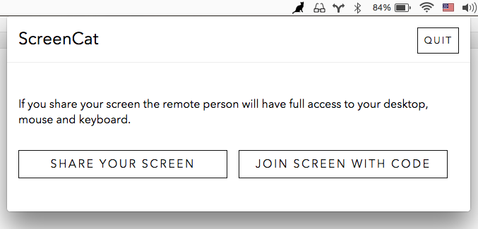

### ScreenCat


ScreenCat is an open source screen sharing + remote collaboration application, currently only for Mac OS. You can share your desktop with someone else while letting them share your mouse and keyboard remotely.

ScreenCat is named after cats, but also for the idea of 'catting' a screen (as in unix cat). It has two C/C++ dependencies, [Atom Shell](https://github.com/atom/atom-shell) (which includes iojs) and [robotjs](https://github.com/octalmage/robotjs) for creating mouse + keyboard events.

ScreenCat is currently **ALPHA STATUS** and is intended for developers/early adopters. Check out the Issues to get involved. ScreenCat is a volunteer run project, your contributions and improvements are welcome!

To download the latest version visit the [releases page](https://github.com/maxogden/screencat/releases)

[](https://github.com/feross/standard)

[](https://travis-ci.org/maxogden/screencat)



##### Developing

```bash
npm install # installs atom-shell and all the deps
npm run app # runs the app in the atom-shell wrapper
npm run build # builds the mac app
```
